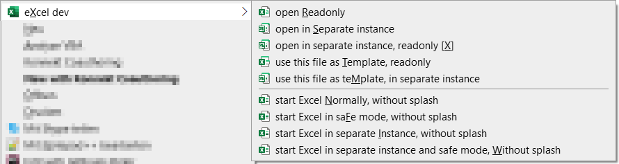
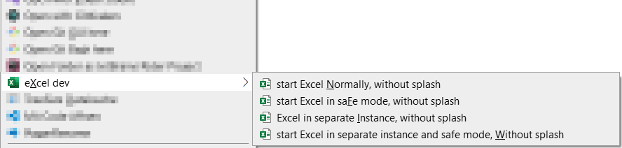

[//]: # (see https://www.markdownguide.org/basic-syntax/ or https://commonmark.org/help/ for Markdown syntax )

# Erweiterung des Dateiexplorer: Kontext-Menü für Excel-Dateien

## Verwendung von Excel in verschiedenen Modi

Bei der Entwicklung von Applikationen in Excel ist es oft nützlich, wenn man Excel-Dateien in verschiedenen Modi öffnen kann:

- **schreibgeschützt**, um von vorneherein sicherzustellen, dass man keine unabsichtlichen Modifikationen vornimmt
- in einer **separaten Instanz**, um die gleiche Datei mehrfach öffnen zu können
- in einer **separaten Instanz**, um gleichnamige Dateien aus verschiedenen Ordnern gleichzeitig öffnen zu können
- als **Vorlage** für eine neue Datei
- im abgesicherten Modus ("safe")
- in einer Kombination dieser Modi

## Lösungsweg

siehe ["Command-line switches for Microsoft Office products"](https://support.microsoft.com/en-gb/office/command-line-switches-for-microsoft-office-products-079164cd-4ef5-4178-b235-441737deb3a6#Category=Excel)

- Mittels Registry-Einträgen wird für den aktuellen Benutzer (HKCU) ein kaskadiertes Kontextmenü definiert
- Dieses Menu wird zuoberst im Kontextmenü angezeigt, wenn eine Excel-Datei selektiert ist
- Das Menu wird auch angezeigt, wenn es bei einem Ordner oder in einem leeren Bereich des Dateiexplorers aufgerufen wird. 
Allerdings dann nicht mehr zuoberst, und nur mit Menüeinträgen für den Start von Excel, ohne dass eine Datei geöffnet würde
- die Startoption "/p", mit der für Excel vermeintlich das Arbeitsverzeichnis sollte gesetzt werden können, funktioniert leider nicht und wird deshalb nicht verwendet.
- Die Menüeinträge erhalten Shortcuts. Da in Windows 11 (zum aktuellen Zeipunkt 2023-09-28) die Shortcuts im Kontextmenü per Default ohne Unterstrich dargestellt werden, ist das Zeichen für die Shortcut-Taste in Grossbuchstaben gesetzt.

> Hinweis: Shortcuts werden nur dann unterstrichen angezeigt, wenn die entsprechende Systemeinstellung aktiviert ist:
>
> 

 

### Submenüs bei Excel-Datei

***

These are the shortcut keys which you can use are:

In File Explorer, select an Excel file, then start with \[SHIFT-F10\] \[x\] or a right mouse click, 
then, for opening files, choose:
- \[r\] &rarr; open <u>R</u>eadonly
- \[s\] &rarr; open in <u>S</u>eparate instance
- \[x\] &rarr; open separate instance, readonly \[<u>X</u>\]
- \[t\] &rarr; use this file as <u>T</u>emplate, readonly
- \[m\] &rarr; use this file as te<u>M</u>plate, in separate instance
----
for starting Excel, without opening a file, choose:
- \[n\] &rarr; start Excel <u>N</u>ormally, without splash
- \[f\] &rarr; start Excel in sa<u>F</u>e mode, without splash
- \[i\] &rarr; start Excel in separate <u>I</u>nstance, without splash
- \[w\] &rarr; start Excel in separate instance and safe mode, <u>W</u>ithout splash

### Submenü in leerem Bereich des Explorer

***

Der Menüeintrag wird nicht mehr zuoberst angezeigt, und es stehen natürlich nur noch die Optionen zum Start von Excel, ohne Öffnen einer Datei, zur Verfügung

## Installation

- Mit Doppelklick auf die Datei "***\[+\]myExcel***_dev_menu.hkcu.reg" in die Registry importieren
- Mit Doppelklick auf die Datei "***\[-\]myExcel***_dev_menu.hkcu.reg" aus der Registry entfernen

## Weitere Infos

- In der .reg-Datei sind Kommentare enthalten, welche u.a. auf die verwendeten Quellen im Internet verweisen
- Kommentare in .reg-Datei sind offiziell erlaubt, sie werden beim Import der Datei in die Registry ignoriert